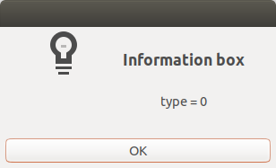
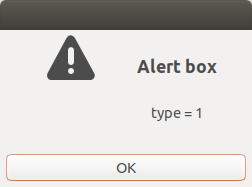
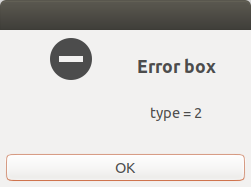
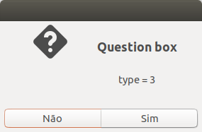
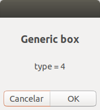

# GTK User Interface Builder Library - UIGTK

UIGTK is a C-language written library designed to simplify the creation of the graphical environment with the GTK toolkit from the [GtkBuilder](https://developer.gnome.org/gtk3/stable/GtkBuilder.html) object.

To help understand the library, the following example interface will be used:

```xml
<?xml version="1.0" encoding="UTF-8"?>
<interface>
	<object id="window" class="GtkWindow">
		<property name="title">-- LIBUIGTK --</property>
		<property name="visible">True</property>
		<signal name="destroy" handler="gtk_main_quit" />
		<child>
			<object class="GtkBox" id="box">
				<property name="visible">True</property>
				<property name="orientation">vertical</property>
				<property name="expand">True</property>
				<child>
					<object class="GtkButton" id="btn1">
						<property name="visible">True</property>
						<property name="label">Hello</property>
						<signal name="clicked" handler="hello" />
					</object>
					<packing>
						<property name="expand">True</property>
						<property name="fill">True</property>
					</packing>
				</child>
				<child>
					<object class="GtkButton" id="btn2">
						<property name="visible">True</property>
						<property name="label">Bye</property>
						<signal name="clicked" handler="bye" />
					</object>
					<packing>
						<property name="expand">True</property>
						<property name="fill">True</property>
					</packing>
				</child>
			</object>
		</child>
	</object>
</interface>
```

This results in the following appearance:


The interface file name will be set to "example.ui".

## Interface construction

The construction is divided into three phases:

- Initialize the library indicated an interface file (.ui);
- Connect the interface signals to their respective handlers; and
- Start the main loop.

### Interface initialization

To initialize the interface, the `uigtk_unit()` function must be used, whose characteristics are described below:

```c
void uigtk_init(char *file);
```

#### Parameters

|Name|Description|
|:--|:--|
|file|Interface file path|

#### Returns

Forces the application to exit if any identifiable error is found. Possible errors are:

- multiple function calls
- Failed to initialize GTK;
- Failed to initialize GTK Builder;
- Failed to load the interface file; and
- Failed to set the top level window.

### Connecting signals

To connect the signals to your handlers, you must use the `uigtk_hadler()` function, whose characteristics are described below:

```c
#define uigtk_handler(handler)
```

#### Parameters

|Name|Description|
|:--|:--|
|handler|Name of the handler function|

#### Returns

Forces the application to exit if any identifiable error is found. Possible errors are:

- Call the function before calling the uigtk_init function.

### Start the main loop

To start the main loop, use the `uigtk_main()` function, whose characteristics are described below:

```c
void uigtk_main()
```
#### Returns

Forces the application to exit if any identifiable error is found. Possible errors are:

- Call the function before calling the uigtk_init function;

At the end of the looping, a new call to the uigtk_init function will be required.

### Example

Considering that the name of the file containing the source code is called "example.c" and that it is in the same directory as the interface file "example.ui", the following sequence of commands will be necessary to build the interface.

Initially it is necessary to include the library header in our source code. Considering that both are in the same directory:

```c
#include "libuigtk.h"
```

As noted in the interface file, there are two defined handlers whose construction needs to be carried out:

```xml
<signal name="clicked" handler="hello" />
...
<signal name="clicked" handler="bye" />
```

The prototypes of the functions would look like this:

```c
void hello(GtkWidget *widget, gpointer data);
void bye(GtkWidget *widget, gpointer data);
```

To start the construction, just call the function to initialize the library indicating the interface file:

```c
uigtk_init("example.ui");
```

After initialization, the manipulators must be connected, according to the signals defined in the interface:

```c
uigtk_handler(gtk_main_quit);
uigtk_handler(hello);
uigtk_handler(bye);
```

Finally, the main loop must be initialized:

```c
uigtk_main();
```

Grouping all the information, we have:

```c
#include "libuigtk.h"

void hello(GtkWidget *widget, gpointer data);

void bye(GtkWidget *widget, gpointer data);

void main(int argc, char *argv[]) {

	/* Interface initialization */
	uigtk_init("example.ui");

	/* Connecting signals */
	uigtk_handler(gtk_main_quit);
	uigtk_handler(hello);
	uigtk_handler(bye);

	/* Start the main loop */	
	uigtk_main();

}
```

Don't forget to define the actions of the manipulators.

## Compilation

The library was tested using the following version of gcc:

> gcc (Ubuntu 7.4.0-1ubuntu1~18.04.1) 7.4.0

To compile and run the application, the following commands were executed:

```sh
gcc `pkg-config --cflags gtk+-3.0` -c libuigtk.c `pkg-config --libs gtk+-3.0`;
gcc `pkg-config --cflags gtk+-3.0` -c example.c  `pkg-config --libs gtk+-3.0`;
gcc `pkg-config --cflags gtk+-3.0` -o example example.o libuigtk.o `pkg-config --libs gtk+-3.0`;
./example;
```

## Tools

The library also has some auxiliary functions in case you need more freedom when designing the interface.

### GTK Builder

If you need to access the pointer to the GTK Builder created by the library, the `uigtk_builder()` function must be used, whose characteristics are described below:

```c
GtkBuilder *uigtk_builder (void)
```

#### Returns

Returns the pointer to GTK Builder. If you want to link the value to a variable, alternatively, you can use the macro below:

```c
#define uigtk_set_builder(var)
```

Where `var` is intended to define the name of the variable to receive the pointer.

### GTK Object

If you need to access the pointer to any interface object ( from its "ID", the `uigtk_object()` function must be used, whose characteristics are described below:

```c
GObject *uigtk_object (char *id)
```

#### Parameters

|Name|Description|
|:--|:--|
|id|Object ID value|


#### Returns

Returns the pointer to object. If you want to link the value to a variable, alternatively, you can use the macro below:

```c
#define uigtk_set_object(var, id)
```

Where `var` is intended to define the name of the variable to receive the pointer.

### Dialog

If you need to access the pointer to any interface object ( from its "ID", the `uigtk_dialog()` function must be used, whose characteristics are described below:

```c
int uigtk_dialog (int type, char *title, char *text)
```

#### Parameters

|Name|Description|
|:--|:--|
|type|Dialog type|
|title|Box title|
|text|Textual content|

#### Types











#### Returns

Returns an integer value depending on the answer:

- -1 if the option "no" is chosen;
- 0 if the box has been closed; and
- 1 if "yes" or "ok" is chosen.

## Release Notes

### v1.0.0

- Published on 2020-03-01

## Author

- Willian Donadelli (<wdonadelli@gmail.com>)
