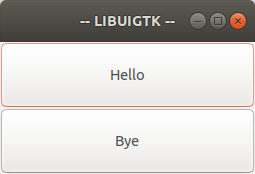

# GTK User Interface Builder Library - UIGTK

UIGTK is a C-language written library designed to simplify the creation of the graphical environment with the GTK toolkit from the [GtkBuilder](https://developer.gnome.org/gtk3/stable/GtkBuilder.html) object.

## Tools

The library has two types of functions, one to create the interface and another to help with simple tasks that may require many lines of code.

To help understand the library, the following example interface will be used:

```xml
<?xml version="1.0" encoding="UTF-8"?>
<interface>
	<object id="window" class="GtkWindow">
		<property name="title">-- LIBUIGTK --</property>
		<property name="visible">True</property>
		<signal name="destroy" handler="gtk_main_quit" />
		<child>
			<object class="GtkBox" id="box">
				<property name="visible">True</property>
				<property name="orientation">vertical</property>
				<property name="expand">True</property>
				<child>
					<object class="GtkButton" id="btn1">
						<property name="visible">True</property>
						<property name="label">Hello</property>
						<signal name="clicked" handler="hello" />
					</object>
					<packing>
						<property name="expand">True</property>
						<property name="fill">True</property>
					</packing>
				</child>
				<child>
					<object class="GtkButton" id="btn2">
						<property name="visible">True</property>
						<property name="label">Bye</property>
						<signal name="clicked" handler="bye" />
					</object>
					<packing>
						<property name="expand">True</property>
						<property name="fill">True</property>
					</packing>
				</child>
			</object>
		</child>
	</object>
</interface>
```

This results in the following appearance:



The interface file name will be set to "example.ui".

## Interface construction

The construction is divided into three phases:

- Initialize the library indicated an interface file (.ui);
- Connect the interface signals to their respective handlers; and
- Start the main loop.

### Interface initialization

To initialize the interface, the `uigtk_unit()` function must be used, whose characteristics are described below:

```c
void uigtk_init(char *file);
```

#### Parameters

|--:|:--|
|file|Interface file path|

#### Returns

Forces the application to exit if any identifiable error is found. Possible errors are:

- GTK startup failure;
- Failure to start GTK Builder; and
- Failed to load the interface file.


